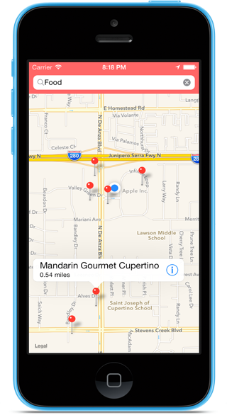

# MASimpleMap

`MASimpleMap` is a demonstration of several iOS7 Mapkit functionalities designed to help beginners work their way through some of the location syntax.  

## Requirements 

`MASimpleMap ` uses ARC and requires iOS 7.0+.

## Usage
Includes the following useful basic iOS7 Mapkit features

 -Plot current location
 -Zoom to current location
 -Searches local area around the current location for places that match your keyword
 -Plots several points with distances
 -Organizes useful data from the plotted points (telephone, website, distance, address, etc.) into a table
 -Highly customizable

## License 

    The MIT License (MIT)

    Copyright (c) 2014 Michael Ackley 

    Permission is hereby granted, free of charge, to any person obtaining a copy
    of this software and associated documentation files (the "Software"), to deal
    in the Software without restriction, including without limitation the rights
    to use, copy, modify, merge, publish, distribute, sublicense, and/or sell
    copies of the Software, and to permit persons to whom the Software is
    furnished to do so, subject to the following conditions:

    The above copyright notice and this permission notice shall be included in
    all copies or substantial portions of the Software.

    THE SOFTWARE IS PROVIDED "AS IS", WITHOUT WARRANTY OF ANY KIND, EXPRESS OR
    IMPLIED, INCLUDING BUT NOT LIMITED TO THE WARRANTIES OF MERCHANTABILITY,
    FITNESS FOR A PARTICULAR PURPOSE AND NONINFRINGEMENT. IN NO EVENT SHALL THE
    AUTHORS OR COPYRIGHT HOLDERS BE LIABLE FOR ANY CLAIM, DAMAGES OR OTHER
    LIABILITY, WHETHER IN AN ACTION OF CONTRACT, TORT OR OTHERWISE, ARISING FROM,
    OUT OF OR IN CONNECTION WITH THE SOFTWARE OR THE USE OR OTHER DEALINGS IN
    THE SOFTWARE.
